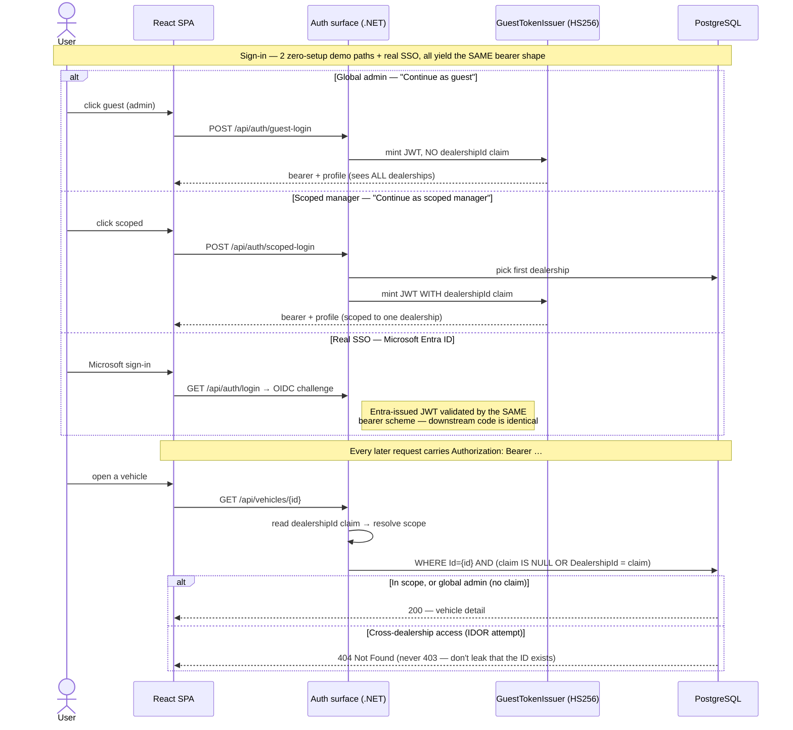
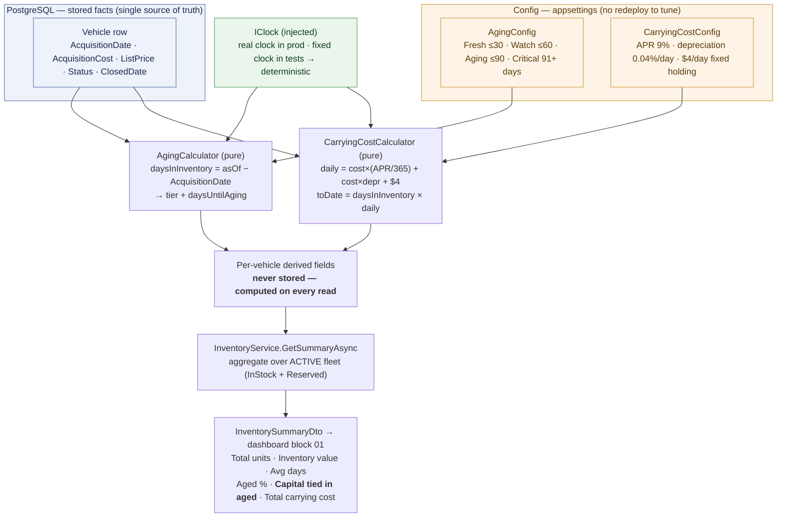
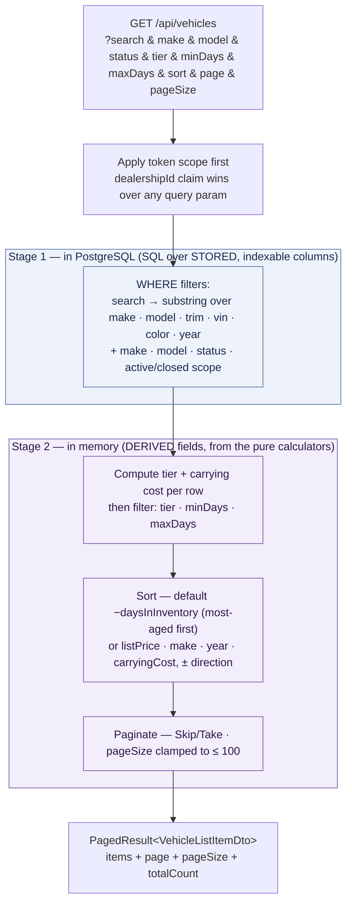
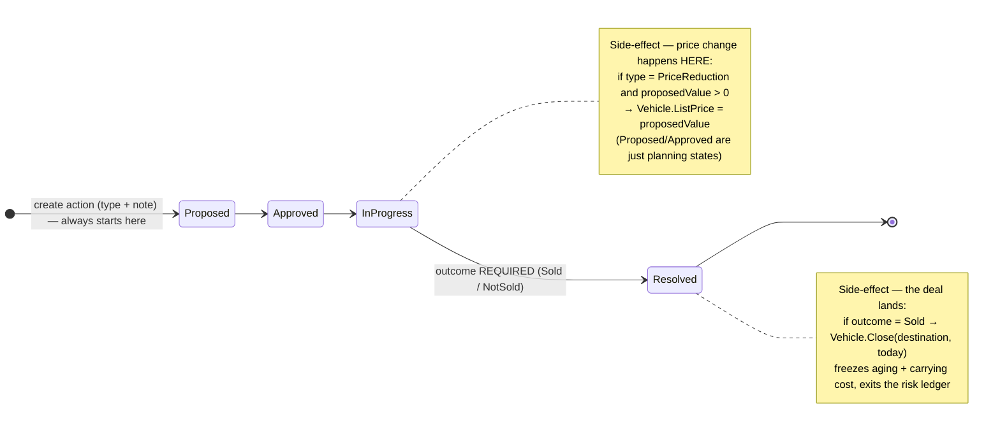
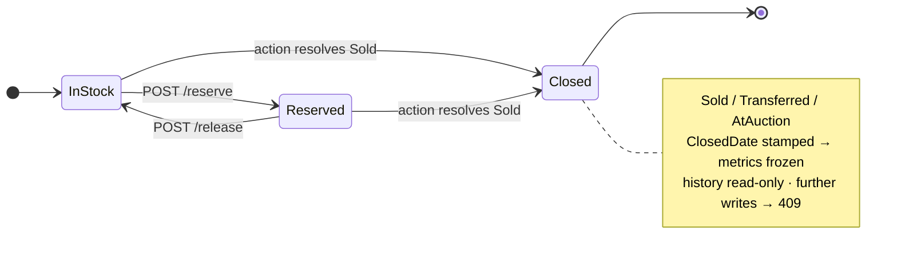
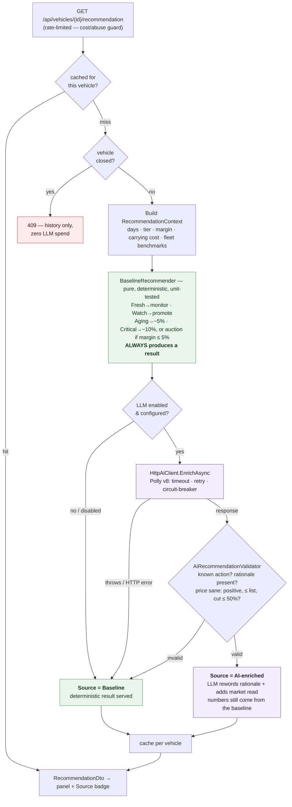
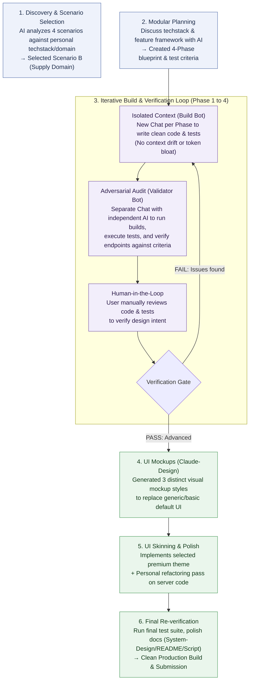

# Demo Diagrams

> Titles + diagrams for screen-sharing while filming. 🚀 **Enhance** blocks = production/scale talking points.

---

## 1. Login & Dealership Scoping — global admin vs scoped manager

🚀 **Enhance: Production-Ready Auth Architecture**
Hybrid model: **"Identity from SSO – Authorization (RBAC) from Local Database"**
*   **Authentication (SSO)**: Authenticate via Entra ID/Okta + JIT (Just-In-Time) user provisioning to local DB on first sign-in.
*   **Authorization (RBAC)**: Manage granular roles and relationships (`Users`, `Roles`, `UserDealerships` many-to-many) in local DB $\rightarrow$ Enrich JWT using ASP.NET Core `IClaimsTransformation`.
*   **Benefits**: Prevents JWT Token Bloat, supports fine-grained policy-based auth, and enables UI Dealership Selector context switching.

---

## 2. Capital Exposure — where every number comes from

---

## 3. Inventory List — search, filter, sort, pagination

🚀 **Enhance: Scaling to Millions of Records (Trade-offs)**
*   **Current Bottleneck**: In-memory derived-field filtering forces **in-memory sorting and pagination (Skip/Take)** $\rightarrow$ Memory/CPU spike if Stage 1 yields millions of rows.
    *   *Mitigation in place*: Dealership scoping (via JWT claims) and active status filters restrict database output to ~100-500 active cars per request, making in-memory calculation safe and viable.
*   **Solution 1: Persist via Scheduler (Daily Batch Job)**
    *   *How*: Compute and persist `AgingTier` and `CarryingCost` in DB tables nightly (e.g., Hangfire/Quartz).
    *   *Trade-off*: Enables index-backed SQL filtering/pagination (extremely fast) vs. Loss of real-time currency accuracy (data updated daily).
*   **Solution 2: Search Engine Integration (Elasticsearch)**
    *   *How*: Stream vehicle edits to a search index; perform calculations during ingestion or indexing.
    *   *Trade-off*: Sub-millisecond multi-dimensional filtering and search at scale vs. Increased architecture complexity and eventual consistency.

---

## 4a. Action Lifecycle — decision of record

## 4b. Vehicle Status — reserve / release / close

🚀 **Enhance: Action Lifecycle & Side-effects**
*   **Role-based Transitions**: Restrict state changes by user roles (e.g., Sales Advisor can only `Propose`, General Manager must `Approve`).
*   **Event-Driven Side-effects**: Publish Domain Events (`VehiclePriceChanged`, `VehicleClosed`) to async messaging queues (RabbitMQ/Kafka) to sync external listings (Autotrader) and update financial accounting systems.

---

## 5. AI Recommendation — grounded, baseline-first, fails safe

🚀 **Enhance: Production-Ready AI Recommendation**
*   **Real-time Market Grounding (RAG)**: Connect with automotive market APIs (AutoTrader/Edmunds) to feed real-time competitor prices, local days-supply, and auction trends into the LLM context.
*   **Feedback Loop & LLM Observability**: Track user interaction with recommendations (Accept / Ignore / Edit) and monitor prompts via LLM observability platforms (LangSmith/Arize) to run A/B testing on pricing models.

---

## 6. AI Collaboration & Verification Loop — how I used GenAI as a co-pilot

