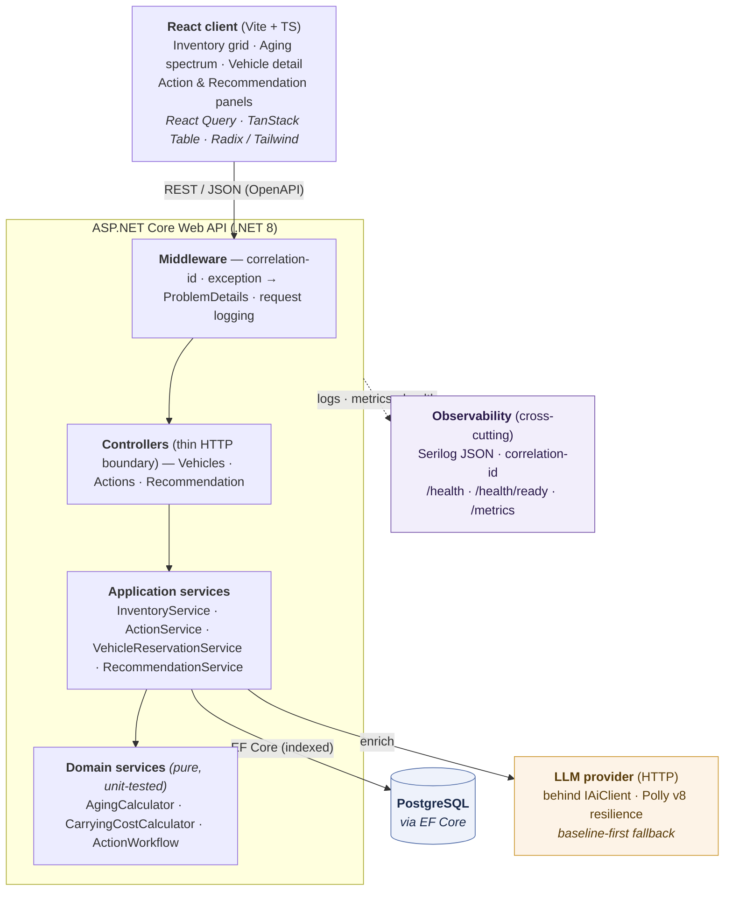
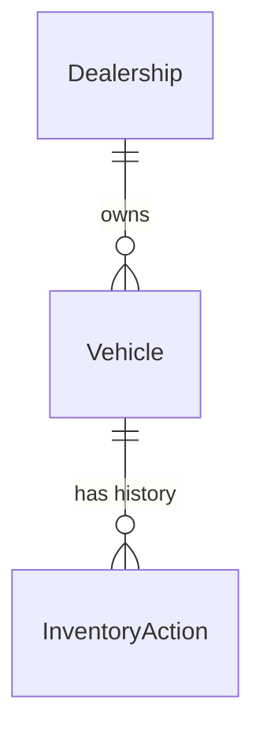

# System Design Document — Intelligent Inventory Dashboard (Scenario B / Supply)

> Technical Assessment — Part 1
> Author: Dat Nguyen
> Status: Final — reconciled to the as-built backend. Where the initial plan and the shipped
> code diverged after polish, this document reflects the code; those deltas are called out inline.

---

## 1. Overview & Problem Framing

**Scenario chosen:** B — Intelligent Inventory Dashboard (Supply domain).

**Reframe (the real product):** This is not "a filterable list of cars." It is a
**capital-at-risk decision-support tool** for a dealership inventory manager.

A dealership buys vehicles largely on borrowed money (*floorplan financing*). Every
day a vehicle sits unsold it bleeds money: floorplan interest + depreciation + holding
costs. Past ~90 days a vehicle is "aged/distressed stock" and is very likely being
sold at a loss. A manager with hundreds of units cannot eyeball which vehicles are
becoming problems.

**The job-to-be-done the app serves:**
1. *Where is my money stuck?* → capital-at-risk KPIs
2. *Which vehicles are (becoming) problems?* → aging spectrum, not a binary flag
3. *How much has each problem vehicle cost me?* → carrying-cost model
4. *What should I do about it?* → AI-assisted action recommendation
5. *What did I decide, and did it work?* → action lifecycle + history

This framing lets every feature carry a user-visible value statement (important for
the demo/presentation dimension) while still exercising real engineering depth.

---

## 2. Architecture

> **As-built note on tracing:** the shipped observability is structured logging (Serilog, correlation-id
> enriched), Prometheus metrics, and liveness/readiness health checks. OpenTelemetry distributed tracing
> was scoped as a design intention (§9) but **not wired** in the delivered build — the correlation id
> threaded through every log line and the ProblemDetails payload is the request-correlation mechanism actually shipped.

### Component roles

| Component | Role |
|---|---|
| **React client** | Demo consumer of the real API. Renders the dashboard, aging spectrum, vehicle detail, action panel, and recommendation panel. Not exhaustive — focused on the demo arc. |
| **Controllers** | Thin HTTP boundary. Model binding, route/verb, delegate to services, return typed `ActionResult<T>`. No business logic. |
| **InventoryService** | Orchestrates listing/filtering + assembles summary KPIs via aggregation. |
| **AgingCalculator** | *Pure* function: days-in-inventory → tier + days-until-aging. Fully unit-tested. |
| **CarryingCostCalculator** | *Pure* function: vehicle + config + "now" → estimated carrying cost. Fully unit-tested. |
| **ActionWorkflow** | *Pure* state machine validating lifecycle transitions. Fully unit-tested. |
| **ActionService** | Persists actions + history, applies `ActionWorkflow` on transitions. |
| **VehicleReservationService** | Reserve/release + vehicle-status transitions, guarded (invalid → 409). |
| **RecommendationService** | Produces an action recommendation: `BaselineRecommender` (pure, always available) first, AI-enriched via `IAiClient` when reachable; caches per vehicle and records metrics. |
| **IAiClient** | Provider-agnostic LLM call, wrapped by the Polly-v8 resilience handler. Isolated so tests never hit the network and the provider is swappable. |
| **EF Core / PostgreSQL** | Persistence. EF provider abstracts the DB, so switching to SQL Server (or another store) is a provider swap. |

---

## 3. Scope & Assumptions

> The assignment explicitly rewards documenting reasonable assumptions under ambiguity.

**Out of scope (deliberately cut to protect the 1-week window):**
- Production SSO wiring to a live Entra tenant (implemented as a design; a zero-setup demo login
  keeps it runnable — see A7). Local username/password is intentionally omitted.
- Multi-tenant isolation beyond the JWT `dealershipId` scoping (no separate schemas / row-level security).
- Bulk actions, CSV/PDF export, notifications, and real DMS/pricing-feed integration (comparables are seeded).

**Assumptions:**
- **A1** — Single currency; monetary values stored as minor units or `decimal`.
- **A2** — A vehicle belongs to exactly one dealership. One or two dealerships seeded.
- **A3** — "Aging" threshold = **90 days** (configurable). Tier bounds:
  Fresh 0–30, Watch 31–60, Aging 61–90, Critical 91+.
- **A4** — Carrying cost is an **estimate** from a configurable model, not accounting truth:
  `dailyCost = acquisitionCost * (apr/365) + dailyDepreciation + fixedDailyHolding`.
  Defaults: apr 9%, dailyDepreciation ≈ acquisitionCost * 0.0004, fixedDailyHolding = $4.
- **A5** — "Comparable sales" signals used by the AI recommender come from seeded data;
  the design isolates this behind a provider so a real feed can replace it later.
- **A6** — `DaysInInventory` is computed against the server's current date (UTC), anchored
  to `AcquisitionDate`. Time is injected into domain logic so it is deterministically testable.
- **A7 — Auth & scoping.** A **single JWT-bearer scheme** accepts both a locally-signed demo token
  and (when a tenant is configured) real Entra-issued tokens, so `[Authorize]` controllers treat both
  identically — no local passwords are stored. Two zero-setup demo logins exist: `guest-login`
  (unconstrained platform admin) and `scoped-login` (tied to the first seeded dealership). When a token
  carries a `dealershipId` claim, every query and command is **auto-scoped to that dealership** and
  cross-dealership access returns `404` (IDOR protection). *As-built delta:* uses plain
  `Microsoft.AspNetCore.Authentication.JwtBearer` against the Entra authority rather than
  `Microsoft.Identity.Web` (equivalent validation, avoids a moderate CVE); issuer class is `GuestTokenIssuer`.

---

## 4. Data Flow

**Read — dashboard load:**
1. Client calls `GET /api/inventory/summary` and `GET /api/vehicles?...`.
2. `InventoryService` queries EF Core (indexed on `dealershipId`, `acquisitionDate`, `make`).
3. For each vehicle, `AgingCalculator` + `CarryingCostCalculator` derive tier and cost
   (computed on read, not stored — single source of truth is `acquisitionDate` + config).
4. Summary aggregates the set (counts, sums, capital-tied-in-aged, averages).
5. Response is DTOs (entities never leave the service layer).

**Recommendation — on demand:**
1. Client calls `GET /api/vehicles/{id}/recommendation`.
2. `RecommendationService` gathers grounding facts (days in stock, list vs comparable,
   segment demand) and computes a **rule-based baseline** via `BaselineRecommender`.
3. If the LLM is reachable, `IAiClient` (Polly-wrapped) enriches the rationale/wording;
   output is validated/parsed. **On timeout/failure the baseline is returned** — the
   feature degrades, it does not break.

**Write — logging an action:**
1. Client `POST /api/vehicles/{id}/actions` with type + proposed value + note.
2. `ActionService` validates, persists an `InventoryAction` (status = `Proposed`).
3. Lifecycle transitions via `PATCH /api/actions/{id}` are gated by `ActionWorkflow`
   (invalid transition → `409 Conflict` with ProblemDetails).
4. Every action is retained as immutable history for the vehicle.

**Vehicle status lifecycle (as-built, added after the initial plan):**
- `POST /vehicles/{id}/reserve` / `release` move an available unit to `Reserved` and back
  (`VehicleReservationService`, guarded so only a valid transition succeeds — else `409`).
- Closing a unit (Sold/Transferred/AtAuction) stamps `ClosedDate`, which **freezes** days-in-inventory
  and carrying cost at the closing date. A closed vehicle is history-only: its recommendation endpoint
  returns `409` rather than proposing new actions.

---

## 5. Data Model

**Vehicle** (persisted)
| Field | Type | Notes |
|---|---|---|
| Id | Guid | PK |
| Vin | string(17) | unique |
| DealershipId | Guid | FK, indexed |
| Make / Model / Year | string / string / int | indexed (make) for filtering |
| Trim / Color / Mileage | string? / string? / int? | optional |
| AcquisitionDate | DateTime (UTC) | anchor for aging + cost; indexed |
| AcquisitionCost | decimal | dealer's cost basis |
| ListPrice | decimal | current asking price |
| Status | enum | InStock / Reserved / Sold / Transferred / AtAuction |
| ClosedDate | DateTime? (UTC) | set iff Status is a closed state (Sold/Transferred/AtAuction); freezes days-in-inventory at closing so a sold unit is history, not live aging |

**InventoryAction** (persisted — the history log)
| Field | Type | Notes |
|---|---|---|
| Id | Guid | PK |
| VehicleId | Guid | FK, indexed |
| Type | enum | PriceReduction / Transfer / Auction / Promote / Recondition / Other |
| Status | enum | Proposed / Approved / InProgress / Resolved |
| ProposedValue | decimal? | e.g. new list price for a reduction |
| Note | string | free text |
| Outcome | enum? | Sold / NotSold (set on Resolved) |
| CreatedAt / UpdatedAt | DateTime (UTC) | audit |

**Derived (computed, never stored)** — the pure-logic test surface:
- `DaysInInventory = (ClosedDate ?? now) − AcquisitionDate` (frozen once the unit closes)
- `AgingTier` = bucket(DaysInInventory) per A3
- `DaysUntilAging` = threshold − DaysInInventory (null once aged)
- `CarryingCostToDate` = DaysInInventory × dailyCost(vehicle, config) per A4

**Aggregated (summary DTO)**: totalUnits, totalInventoryValue, agedUnits, agedPercent,
capitalTiedInAged, avgDaysInInventory, totalCarryingCostToDate, tierBreakdown.

---

## 6. API Contract (REST)

Base: `/api`. All responses JSON. Errors use **RFC 7807 ProblemDetails**.

| Method | Route | Purpose |
|---|---|---|
| GET | `/vehicles?make=&model=&tier=&status=&minDays=&maxDays=&sort=&page=&pageSize=` | Filterable, paginated list (auto-scoped to the caller's JWT dealership claim) |
| GET | `/vehicles/{id}` | Vehicle detail + action history (returns 404 if vehicle belongs to another dealership) |
| GET | `/inventory/summary` | Capital-at-risk KPI payload (auto-scoped via JWT claim) |
| GET | `/inventory/aging` | Aging/Critical subset (auto-scoped via JWT claim) |
| POST | `/vehicles/{id}/actions` | Log a new action (status = Proposed; guarded by ownership check) |
| POST | `/vehicles/{id}/reserve` | Put an available vehicle on customer hold (guarded by ownership check) |
| POST | `/vehicles/{id}/release` | Release a reserved vehicle back to available (guarded by ownership check) |
| PATCH | `/actions/{id}` | Lifecycle transition / set outcome (guarded by ownership check) |
| GET | `/vehicles/{id}/recommendation` | AI-assisted (or baseline) action recommendation |
| GET | `/auth/login` | Initiates Entra ID OIDC challenge (real SSO); 404 if no tenant configured |
| POST | `/auth/guest-login` | Guest/demo login → JWT for unconstrained platform admin |
| POST | `/auth/scoped-login` | Scoped demo login → JWT tied to the first dealership in the DB |
| GET | `/auth/me` | Current user profile from the bearer token |
| GET | `/health` · `/health/ready` | Liveness · readiness (DB hard + AI soft) |
| GET | `/metrics` | Prometheus metrics |

Full OpenAPI spec is generated by Swashbuckle and served at `/swagger`. This doubles as
the fallback "client contract" if the React layer is time-boxed out.

**Status code mapping:** 400 invalid input · 401 unauthenticated on a write endpoint · 404 not
found · 409 invalid lifecycle/reservation transition, or a recommendation requested on a *closed*
vehicle · 429 recommendation rate limit exceeded · 500 unexpected. The recommendation path itself
never returns 5xx for AI failure — it **always degrades to the baseline**.

---

## 7. Technology Choices & Justification

| Layer | Choice | Why |
|---|---|---|
| Backend framework | **ASP.NET Core Web API (.NET 8 LTS)** | I chose modern LTS .NET to demonstrate current C# (async `ActionResult<T>`, minimal hosting, DI). |
| Persistence | **EF Core + PostgreSQL** | EF Core is the idiomatic .NET ORM; Postgres is free & Docker-trivial for local dev. **Swapping to SQL Server is a one-line EF provider change** — noted deliberately. |
| Validation | **FluentValidation** | Readable, testable request validation separate from controllers. |
| Errors | **ProblemDetails** middleware | Consistent, frontend-parseable error contract. |
| Logging | **Serilog** (structured JSON, `CompactJsonFormatter`) | Correlation-id enrichment, sink-agnostic. |
| Metrics | **prometheus-net** (`/metrics`) | Explicit observability story (below). *(Distributed tracing was planned but not shipped — see §9.)* |
| AI resilience | **`Microsoft.Extensions.Http.Resilience`** (Polly v8 standard handler) via `IHttpClientFactory` | Idiomatic .NET resilience (timeout/retry/circuit-breaker) around the external LLM. |
| API docs | **Swashbuckle / OpenAPI** | Live contract at `/swagger`; fallback client. |
| Tests | **xUnit + FluentAssertions** (+ `WebApplicationFactory` + EF Core InMemory for integration) | Standard .NET test stack; readable assertions. |
| Frontend | **React 18 (Vite + TS) · React Query · Radix UI + Tailwind (shadcn-style) · TanStack Table · MSAL** | I picked React with Vite over Next since SSR isn't needed here. shadcn-style Radix primitives for clean, ownable components; TanStack Table for the filterable/sortable/paginated grid; React Query for caching/loading/error; MSAL for the Entra sign-in path. |
| LLM provider | **Provider-agnostic `IAiClient`**; default is Groq's OpenAI-compatible endpoint (`llama-3.1-8b-instant`) | The architectural point is the abstraction + graceful degradation, not the vendor. Runs baseline-only when no API key is set. |

---

## 8. AI Feature Design (the on-brand differentiator, done responsibly)

**What:** For an aging/critical vehicle, produce a concrete recommended action + a
grounded rationale, e.g. *"Recommend a 5% price reduction. This unit has been in stock
118 days (40% longer than the segment average); 3 comparable units sold within 60 days
of a price cut."*

**Design principles:**
1. **Grounded, not hallucinated** — the service assembles factual signals (days in stock,
   list-vs-comparable delta, segment demand) and passes them as structured context.
2. **Baseline first** — a deterministic rule-based recommender always produces a result;
   this is *pure, unit-tested logic*. The LLM only enriches phrasing/rationale.
3. **Graceful degradation** — LLM timeout/error → return the baseline. The feature never
   takes the app down; readiness reports AI status separately.
4. **Output validation** — LLM response is parsed into a typed shape and validated
   (allowed action types, sane bounds); malformed output falls back to baseline.
5. **Isolated & swappable** — `IAiClient` behind Polly; tests use a fake, never the network.
6. **Abuse/cost control on a public demo** — because the demo is publicly reachable behind an
   open guest login, the recommendation endpoint is protected against quota/cost abuse:
   per-vehicle **caching** of recommendations, **rate limiting**, and a cheap/free model with
   a spend cap. This is an operational safeguard, not just a feature toggle.

This makes AI a *decision-support feature* (user value) rather than a gimmick, and it
gives a clean two-layer AI narrative for the video: AI used to **build** the app, and AI
embedded as a **product** feature — verified and owned, not blindly trusted.

---

## 9. Observability Strategy

Most take-homes skip this; the assignment asks for it explicitly, so it's a differentiator.

- **Logging** — Serilog structured JSON. A middleware assigns a **correlation id** per
  request (returned as `X-Correlation-Id`) and enriches every log line. Business events
  are logged: action created, lifecycle transition, recommendation requested, AI call
  outcome (success/fallback/latency).
- **Metrics** — `/metrics` (prometheus-net): automatic HTTP request count/latency by route
  (`UseHttpMetrics`), plus app metrics in `AppMetrics` — a recommendation-outcome counter labelled
  `source` (ai vs baseline, so degradation shows as baseline growth), an AI-call latency histogram
  labelled by outcome, and a business gauge for aged-units served.
- **Request correlation (tracing-lite)** — a correlation id is generated per request, pushed into
  Serilog's `LogContext`, returned as `X-Correlation-Id`, and echoed in every ProblemDetails body — so a
  failed request can be traced across its log lines and error response. Full **OpenTelemetry distributed
  tracing** (request → EF query → outbound AI span) is the documented next step but is **not in the
  shipped build**; it was cut to protect the one-week window and is called out here rather than implied.
- **Health** — `/health` (liveness) and `/health/ready` (checks DB connectivity and AI
  provider reachability; AI-down reports *degraded*, not *unhealthy*).

---

## 10. Testing Strategy

Test the logic that carries risk; don't chase coverage on plumbing. **139 tests, all green.**

**Unit (the core — pure, deterministic, clock injected):**
- `AgingCalculator` — tier boundaries (30/60/90), days-until-aging, exactly-at-threshold.
- `CarryingCostCalculator` — cost accrual over N days, config variations, zero/edge days.
- `ActionWorkflow` — every valid transition passes; every invalid transition is rejected.
- `BaselineRecommender` — correct action chosen for given signal combinations.
- `Vehicle` closing invariant — `ClosedDate` set iff status is closed; days-in-inventory frozen.

**Integration (`WebApplicationFactory` + EF Core InMemory provider, `FakeClock`, `FakeAiClient`):**
- `GET /vehicles` filtering + pagination returns expected set.
- `GET /inventory/summary` aggregates correctly against seeded data.
- `POST /actions` then invalid `PATCH` transition → `409`.
- Reserve/release lifecycle and closed-vehicle rules (recommendation on a closed unit → `409`).
- Auth: `[Authorize]` write endpoints reject anonymous; guest-login mints a usable bearer.
- Recommendation path with a **faked `IAiClient` that throws** → returns baseline (degradation);
  AI success path enriches; cache hit avoids a second call.
- Observability: correlation id echoed; unhandled error → ProblemDetails with no stack leak.

**Explicitly not tested:** framework plumbing, Serilog config, Swagger generation.

---

## 11. Layer Decision & Fallback

The **.NET backend is the fully-built, graded layer** — REST API, PostgreSQL, 139 tests,
observability, and single-scheme JWT auth (A7). The **React client is shipped** as a real (not
mocked) consumer covering the demo arc. If the UI were ever dropped, **Swagger UI + the OpenAPI
spec** stand as the client contract (the assignment permits this), so the backend's value holds either way.

---

## 12. GenAI Collaboration & Verification Lifecycle

This project was built with GenAI as an essential collaborator. Rather than using GenAI as a simple copy-paste code generator, I designed a structured, multi-stage engineering co-pilot workflow covering the entire software development lifecycle (SDLC).

### 12.1. Discovery & Design Phase (Scenario Selection & Domain Modeling)
- **Scenario Analysis:** I prompted the AI to analyze all four assessment scenarios against my personal tech stack, historical experience, and domain expertise. This helped identify the core engineering challenges and choose **Scenario B** based on reasoned product-value alignment.
- **Domain Modeling:** I worked with the AI to map out real dealership economics (floorplan financing, holding costs, aging stock dynamics), which reframed the assignment from a simple "filterable list of cars" into a **capital-at-risk decision-support tool**.
- **Tech Stack & Feature Blueprint:** Discussed architectural trade-offs back and forth to establish the core tech stack (.NET 8, PostgreSQL, React, Vite) and a basic feature skeleton.

### 12.2. Phased Implementation Plan (Context Isolation)
- **Modular Planning:** The AI drafted a structured, 4-phase implementation plan (documented in `IMPLEMENTATION-PLAN.md`) with explicit, objectively testable acceptance criteria for each phase.
- **Context Isolation:** To prevent context drift, token bloat, and compilation errors, I opened a **fresh, isolated AI conversation for each implementation phase**. The prompt for each phase was strictly scoped to that phase's requirements.

### 12.3. Dual-Layer Verification Loop (Adversarial Bot + Human Review)
- **Adversarial AI Verification:** After the implementation model completed a phase, I started a separate, independent conversation with a validator bot. This bot acted as an adversarial code auditor, verifying the implementation against the phase's acceptance criteria by running builds, executing tests, and testing APIs.
- **Personal Verification:** I reviewed the code and manually verified the features at each step to ensure design alignment. If gaps were found, I directed the implementation bot to refine the code before proceeding. This loop was repeated for all 4 phases.

### 12.4. Dedicated UI Makeover & Polish
- **Mockup Generation:** Once the functional application was complete, I used a specialized design bot (`claude-design`) to draft 3 distinct UI mockups representing different visual aesthetics.
- **UI Skinning:** I selected the most polished style to redesign the basic, default UI. This gave the frontend a premium, cohesive, and ownable feel, converting generic components into a unified decision dashboard.
- **Refactoring & Refinement:** I personally conducted a final code review, directing the bot to refactor less optimal sections, clean up warnings, and produce the final documentation files (`README.md`, `SYSTEM-DESIGN.md`, and the demo script).

This structured loop ensures that I remain the architect directing the solution, verifying every line of code, and owning the end result, while utilizing GenAI as a powerful accelerator.
